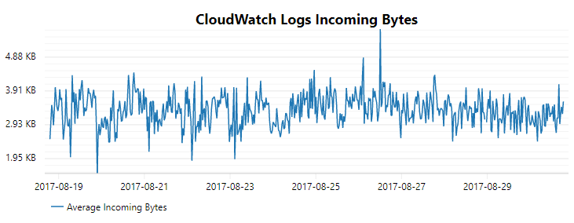

# Narochno.CloudWatch.Graphs [](https://ci.appveyor.com/project/Narochno/narochno-cloudwatch-graphs/branch/master) [](https://www.nuget.org/packages/Narochno.CloudWatch.Graphs/)
A library for plotting graphs from CloudWatch metrics.

## Example Usage



```csharp
var provider = new ServiceCollection()
    .AddSingleton<IAmazonCloudWatch>(new AmazonCloudWatchClient(RegionEndpoint.EUWest1))
    .AddCloudWatchGraphs()
    .BuildServiceProvider();

var plotBuilder = provider.GetService<IPlotBuilder>();

var plotModel = await plotBuilder.WithTime(DateTime.UtcNow.AddDays(-4), DateTime.UtcNow)
    .AddMetric("AWS/Logs", "IncomingBytes")
        .PlotGraph(GraphType.Line, StatisticType.Average, TimeSpan.FromMinutes(5))
    .Generate();

var svgExporter = new SvgExporter
{
    Width = 750,
    Height = 300
};

using (var output = File.OpenWrite("example.svg"))
{
    svgExporter.Export(plotModel, output);
}
```
